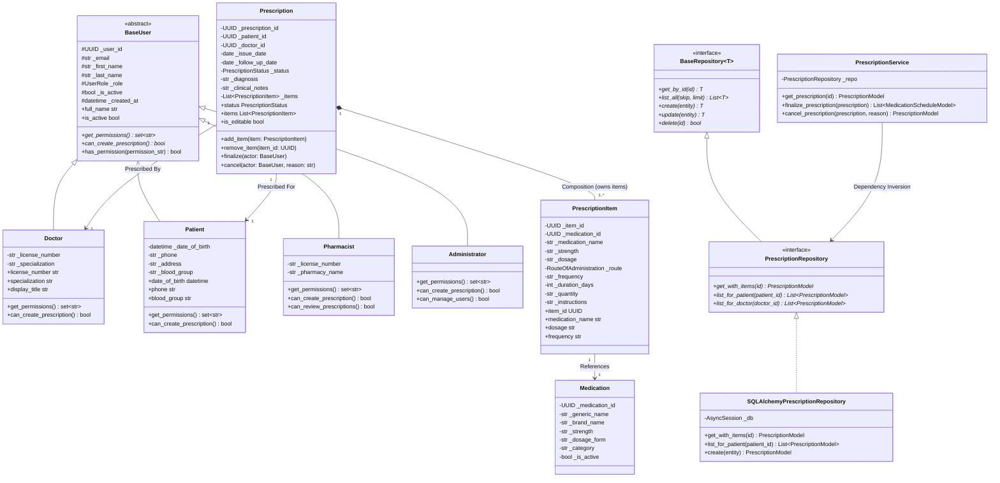

# ArogyaNova — UML Class Diagram

This diagram documents the structural domain architecture of ArogyaNova, showing domain entities, abstract contracts, concrete implementations, and associations.

```mermaid
classDiagram
    %% Core Domain Entities
    class BaseUser {
        <<abstract>>
        #UUID _user_id
        #str _email
        #str _first_name
        #str _last_name
        #UserRole _role
        #bool _is_active
        #datetime _created_at
        +get_permissions()* set~str~
        +can_create_prescription()* bool
        +has_permission(permission_str) bool
        +full_name str
        +is_active bool
    }

    class Doctor {
        -str _license_number
        -str _specialization
        +get_permissions() set~str~
        +can_create_prescription() bool
        +license_number str
        +specialization str
        +display_title str
    }

    class Patient {
        -datetime _date_of_birth
        -str _phone
        -str _address
        -str _blood_group
        +get_permissions() set~str~
        +can_create_prescription() bool
        +date_of_birth datetime
        +phone str
        +blood_group str
    }

    class Pharmacist {
        -str _license_number
        -str _pharmacy_name
        +get_permissions() set~str~
        +can_create_prescription() bool
        +can_review_prescriptions() bool
    }

    class Administrator {
        +get_permissions() set~str~
        +can_create_prescription() bool
        +can_manage_users() bool
    }

    BaseUser <|-- Doctor
    BaseUser <|-- Patient
    BaseUser <|-- Pharmacist
    BaseUser <|-- Administrator

    %% Prescription Aggregation and Composition
    class Prescription {
        -UUID _prescription_id
        -UUID _patient_id
        -UUID _doctor_id
        -date _issue_date
        -date _follow_up_date
        -PrescriptionStatus _status
        -str _diagnosis
        -str _clinical_notes
        -List~PrescriptionItem~ _items
        +add_item(item: PrescriptionItem)
        +remove_item(item_id: UUID)
        +finalize(actor: BaseUser)
        +cancel(actor: BaseUser, reason: str)
        +status PrescriptionStatus
        +items List~PrescriptionItem~
        +is_editable bool
    }

    class PrescriptionItem {
        -UUID _item_id
        -UUID _medication_id
        -str _medication_name
        -str _strength
        -str _dosage
        -RouteOfAdministration _route
        -str _frequency
        -int _duration_days
        -str _quantity
        -str _instructions
        +item_id UUID
        +medication_name str
        +dosage str
        +frequency str
    }

    class Medication {
        -UUID _medication_id
        -str _generic_name
        -str _brand_name
        -str _strength
        -str _dosage_form
        -str _category
        -bool _is_active
    }

    Prescription "1" *-- "1..*" PrescriptionItem : Composition (owns items)
    PrescriptionItem "1" --> "1" Medication : References
    Prescription "1" --> "1" Patient : Prescribed For
    Prescription "1" --> "1" Doctor : Prescribed By

    %% Repositories (Abstraction & Inversion)
    class BaseRepository~T~ {
        <<interface>>
        +get_by_id(id)* T
        +list_all(skip, limit)* List~T~
        +create(entity)* T
        +update(entity)* T
        +delete(id)* bool
    }

    class PrescriptionRepository {
        <<interface>>
        +get_with_items(id)* PrescriptionModel
        +list_for_patient(patient_id)* List~PrescriptionModel~
        +list_for_doctor(doctor_id)* List~PrescriptionModel~
    }

    class SQLAlchemyPrescriptionRepository {
        -AsyncSession _db
        +get_with_items(id) PrescriptionModel
        +list_for_patient(patient_id) List~PrescriptionModel~
        +create(entity) PrescriptionModel
    }

    BaseRepository <|-- PrescriptionRepository
    PrescriptionRepository <|.. SQLAlchemyPrescriptionRepository

    %% Domain Services
    class PrescriptionService {
        -PrescriptionRepository _repo
        +get_prescription(id) PrescriptionModel
        +finalize_prescription(prescription) List~MedicationScheduleModel~
        +cancel_prescription(prescription, reason) PrescriptionModel
    }

    PrescriptionService --> PrescriptionRepository : Dependency Inversion
```
