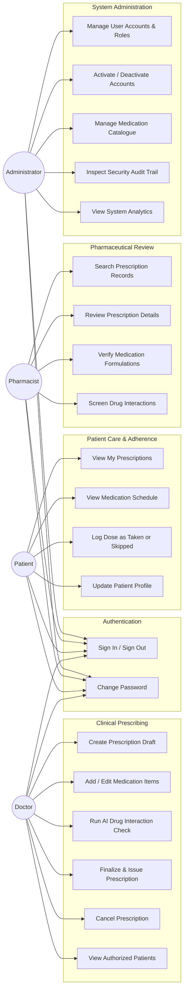

# ArogyaNova — Use Case Diagram

This diagram specifies the primary use cases and functional interactions available to the four system actors: Doctor, Patient, Pharmacist, and Administrator.

```mermaid
graph LR
    %% Actors
    Doc((Doctor))
    Pat((Patient))
    Pharm((Pharmacist))
    Admin((Administrator))

    %% Doctor Use Cases
    subgraph Clinical Prescribing
        UC1[Create Prescription Draft]
        UC2[Add / Edit Medication Items]
        UC3[Run AI Drug Interaction Check]
        UC4[Finalize & Issue Prescription]
        UC5[Cancel Prescription]
        UC6[View Authorized Patients]
    end

    %% Patient Use Cases
    subgraph Patient Care & Adherence
        UC7[View My Prescriptions]
        UC8[View Medication Schedule]
        UC9[Log Dose as Taken or Skipped]
        UC10[Update Patient Profile]
    end

    %% Pharmacist Use Cases
    subgraph Pharmaceutical Review
        UC11[Search Prescription Records]
        UC12[Review Prescription Details]
        UC13[Verify Medication Formulations]
        UC14[Screen Drug Interactions]
    end

    %% Administrator Use Cases
    subgraph System Administration
        UC15[Manage User Accounts & Roles]
        UC16[Activate / Deactivate Accounts]
        UC17[Manage Medication Catalogue]
        UC18[Inspect Security Audit Trail]
        UC19[View System Analytics]
    end

    %% Common
    subgraph Authentication
        UC20[Sign In / Sign Out]
        UC21[Change Password]
    end

    %% Connections
    Doc --> UC1
    Doc --> UC2
    Doc --> UC3
    Doc --> UC4
    Doc --> UC5
    Doc --> UC6
    Doc --> UC20
    Doc --> UC21

    Pat --> UC7
    Pat --> UC8
    Pat --> UC9
    Pat --> UC10
    Pat --> UC20
    Pat --> UC21

    Pharm --> UC11
    Pharm --> UC12
    Pharm --> UC13
    Pharm --> UC14
    Pharm --> UC20
    Pharm --> UC21

    Admin --> UC15
    Admin --> UC16
    Admin --> UC17
    Admin --> UC18
    Admin --> UC19
    Admin --> UC20
    Admin --> UC21
```
